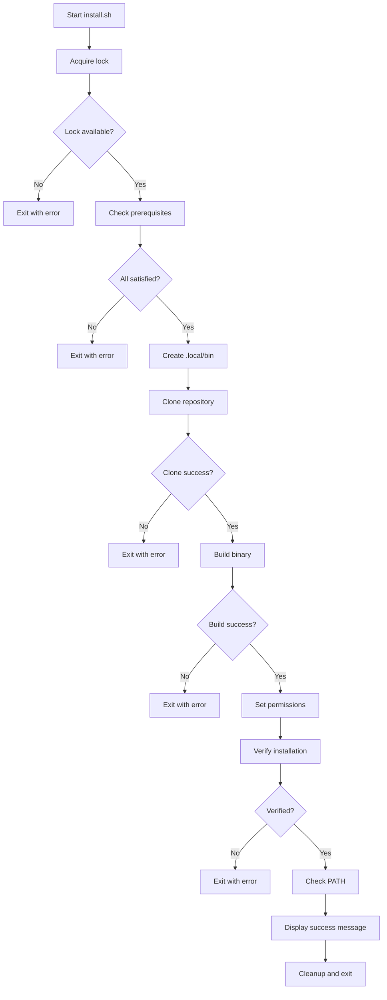
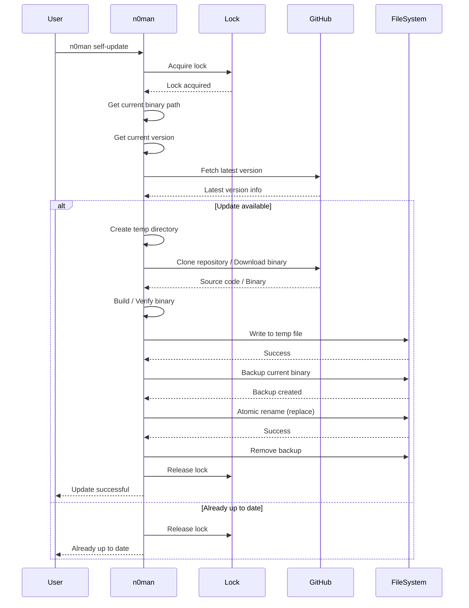
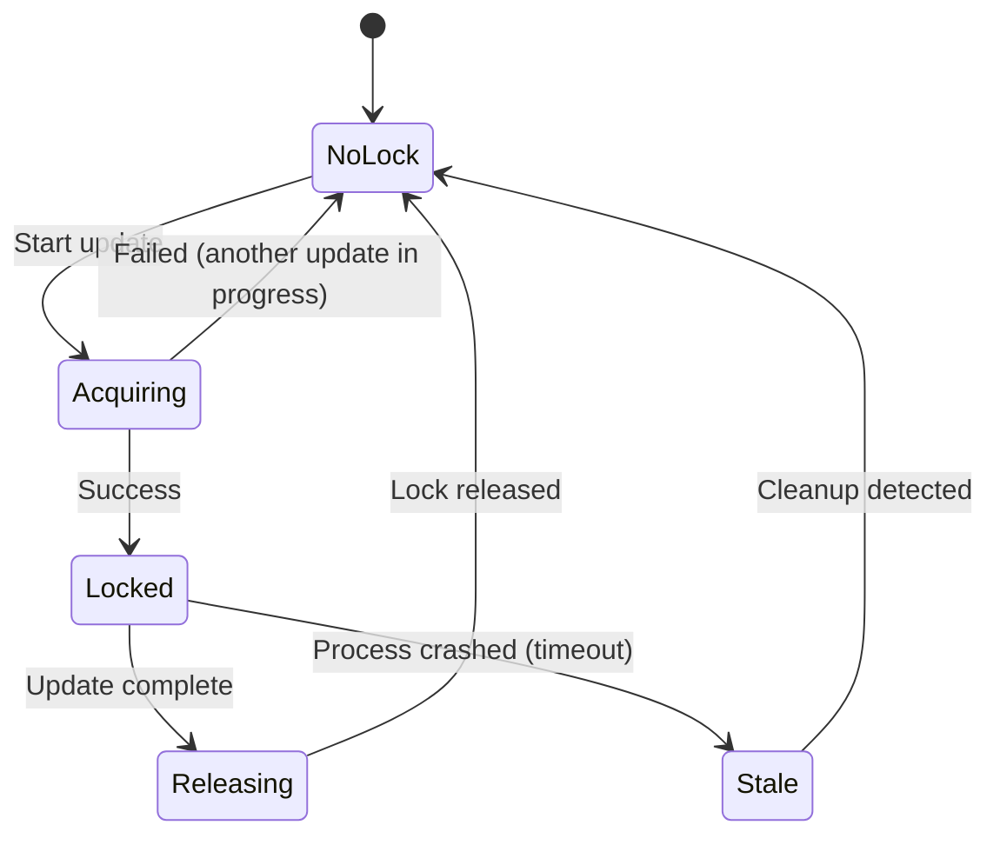

# n0man Installation and Self-Update Mechanism Design

## Executive Summary

This document outlines a comprehensive design for n0man's installation and self-update mechanisms. The solution provides a seamless one-line installation experience via curl and a robust self-update capability that handles the complex case of updating a running binary.

## Table of Contents

1. [Design Overview](#design-overview)
2. [Install Script Design](#install-script-design)
3. [Self-Update Mechanism Design](#self-update-mechanism-design)
4. [Binary Update Strategy](#binary-update-strategy)
5. [Lock File Mechanism](#lock-file-mechanism)
6. [Error Handling and Recovery](#error-handling-and-recovery)
7. [Security Considerations](#security-considerations)
8. [Platform-Specific Considerations](#platform-specific-considerations)
9. [Testing Strategy](#testing-strategy)
10. [Implementation Roadmap](#implementation-roadmap)

---

## Design Overview

### Current State Analysis

The current [`self_update.go`](../internal/cmd/self_update.go) implementation has several limitations:

1. **Installation Location Mismatch**: Uses `go install` which installs to `$GOPATH/bin` or `$GOBIN`, not `$HOME/.local/bin`
2. **No Binary Replacement**: Cannot update the running binary in-place
3. **No Atomic Operations**: Risk of corruption if update fails mid-process
4. **No Lock Mechanism**: Multiple concurrent updates could cause issues
5. **No Rollback**: If update fails, user is left in undefined state

### Design Goals

1. **Consistent Installation Path**: Always install to `$HOME/.local/bin/n0man`
2. **In-Place Updates**: Update the binary at its current location
3. **Atomic Operations**: Use temp file + atomic rename for safe updates
4. **Lock-Based Concurrency**: Prevent multiple simultaneous updates
5. **Graceful Error Handling**: Clear error messages with recovery options
6. **Cross-Platform Support**: Work on Linux and macOS
7. **Security**: Validate downloads, check checksums, verify signatures

### Architecture Diagram

```mermaid
graph TB
    subgraph "Installation Flow"
        A[User runs curl one-liner] --> B[install.sh downloads]
        B --> C[Detect Go installation]
        C -->|Go found| D[Create .local/bin directory]
        C -->|Go not found| E[Install Go or show error]
        D --> F[Clone repository to temp dir]
        F --> G[Build binary with go build]
        G --> H[Install to .local/bin/n0man]
        H --> I[Set executable permissions]
        I --> J[Verify installation]
        J --> K[Update PATH if needed]
        K --> L[Success message]
    end

    subgraph "Self-Update Flow"
        M[User runs n0man self-update] --> N[Acquire update lock]
        N -->|Lock acquired| O[Detect current binary path]
        O --> P[Check for newer version]
        P -->|Update available| Q[Download/build new version]
        Q --> R[Write to temp file]
        R --> S[Verify new binary]
        S --> T[Atomic rename to replace old binary]
        T --> U[Release lock]
        U --> V[Success message]
        P -->|No update| W[Already up-to-date message]
        N -->|Lock held| X[Show update in progress message]
    end

    subgraph "Error Recovery"
        Y[Error occurs] --> Z[Log error details]
        Z --> AA[Cleanup temp files]
        AA --> AB[Release lock if held]
        AB --> AC[Restore backup if exists]
        AC --> AD[Show user-friendly error]
        AD --> AE[Suggest manual update steps]
    end
```



---

## Install Script Design

### Script Structure

The [`install.sh`](../install.sh) script will be a single bash script with the following sections:

```bash
#!/usr/bin/bash
# n0man Installation Script
# Usage: curl -sSL https://raw.githubusercontent.com/noeltz/n0man/main/install.sh | bash

# 1. Configuration and Constants
# 2. Utility Functions
# 3. Prerequisite Checks
# 4. Installation Logic
# 5. Post-Installation Setup
# 6. Error Handling
```

### Key Functions

#### 1. Configuration and Constants

```bash
# Installation target
INSTALL_DIR="$HOME/.local/bin"
BINARY_NAME="n0man"
INSTALL_PATH="$INSTALL_DIR/$BINARY_NAME"

# Repository information
REPO_URL="https://github.com/noeltz/n0man.git"
REPO_BRANCH="main"

# Temporary directory for build
TEMP_DIR=$(mktemp -d)
BUILD_DIR="$TEMP_DIR/n0man"

# Lock file to prevent concurrent installations
LOCK_FILE="/tmp/n0man-install.lock"
```

#### 2. Utility Functions

```bash
# Logging functions with colors
log_info() { echo -e "\033[0;34mℹ\033[0m $*"; }
log_success() { echo -e "\033[0;32m✓\033[0m $*"; }
log_error() { echo -e "\033[0;31m✗\033[0m $*"; }
log_warn() { echo -e "\033[0;33m⚠\033[0m $*"; }

# Cleanup function
cleanup() {
    log_info "Cleaning up temporary files..."
    rm -rf "$TEMP_DIR"
    rm -f "$LOCK_FILE"
}

# Set trap for cleanup on exit
trap cleanup EXIT
```

#### 3. Prerequisite Checks

```bash
check_prerequisites() {
    log_info "Checking prerequisites..."
    
    # Check for bash
    if ! command -v bash &> /dev/null; then
        log_error "bash is required but not installed"
        exit 1
    fi
    
    # Check for curl or wget
    if ! command -v curl &> /dev/null && ! command -v wget &> /dev/null; then
        log_error "curl or wget is required to download files"
        exit 1
    fi
    
    # Check for git
    if ! command -v git &> /dev/null; then
        log_error "git is required but not installed"
        log_info "Install git: sudo apt install git (Ubuntu/Debian)"
        log_info "              brew install git (macOS)"
        exit 1
    fi
    
    # Check for Go
    if ! command -v go &> /dev/null; then
        log_error "Go is required but not installed"
        log_info "Install Go: https://go.dev/dl/"
        exit 1
    fi
    
    # Verify Go version (requires 1.22+)
    GO_VERSION=$(go version | awk '{print $3}' | sed 's/go//')
    log_info "Found Go version: $GO_VERSION"
    
    log_success "All prerequisites satisfied"
}
```

#### 4. Installation Logic

```bash
acquire_lock() {
    if [ -f "$LOCK_FILE" ]; then
        local lock_age=$(($(date +%s) - $(stat -c %Y "$LOCK_FILE" 2>/dev/null || echo 0)))
        if [ $lock_age -lt 3600 ]; then  # Lock is less than 1 hour old
            log_error "Installation already in progress (lock file exists)"
            log_info "If this is incorrect, remove: $LOCK_FILE"
            exit 1
        fi
        log_warn "Removing stale lock file..."
        rm -f "$LOCK_FILE"
    fi
    
    echo $$ > "$LOCK_FILE"
}

create_install_directory() {
    log_info "Creating installation directory: $INSTALL_DIR"
    
    if [ ! -d "$INSTALL_DIR" ]; then
        mkdir -p "$INSTALL_DIR"
        log_success "Created $INSTALL_DIR"
    else
        log_info "Directory already exists: $INSTALL_DIR"
    fi
}

clone_repository() {
    log_info "Cloning repository from $REPO_URL..."
    
    if ! git clone --depth 1 --branch "$REPO_BRANCH" "$REPO_URL" "$BUILD_DIR"; then
        log_error "Failed to clone repository"
        exit 1
    fi
    
    log_success "Repository cloned successfully"
}

build_binary() {
    log_info "Building n0man binary..."
    
    cd "$BUILD_DIR"
    
    # Set GOBIN to install directory for consistent path
    export GOBIN="$INSTALL_DIR"
    
    # Build with version information
    VERSION=$(git describe --tags --always --dirty 2>/dev/null || echo "dev")
    BUILD_TIME=$(date -u +"%Y-%m-%dT%H:%M:%SZ")
    
    if ! go build \
        -ldflags="-X main.Version=$VERSION -X main.BuildTime=$BUILD_TIME" \
        -o "$INSTALL_PATH" \
        ./cmd/n0man; then
        log_error "Failed to build binary"
        exit 1
    fi
    
    log_success "Binary built successfully"
}

set_permissions() {
    log_info "Setting executable permissions..."
    
    if ! chmod +x "$INSTALL_PATH"; then
        log_error "Failed to set executable permissions"
        exit 1
    fi
    
    log_success "Permissions set successfully"
}

verify_installation() {
    log_info "Verifying installation..."
    
    if [ ! -f "$INSTALL_PATH" ]; then
        log_error "Binary not found at $INSTALL_PATH"
        exit 1
    fi
    
    if ! "$INSTALL_PATH" --help &> /dev/null; then
        log_error "Binary exists but is not functional"
        exit 1
    fi
    
    log_success "Installation verified successfully"
}

check_path() {
    if [[ ":$PATH:" != *":$INSTALL_DIR:"* ]]; then
        log_warn "$INSTALL_DIR is not in your PATH"
        log_info "Add the following to your shell configuration:"
        echo ""
        echo "  export PATH=\"\$PATH:\$HOME/.local/bin\""
        echo ""
        log_info "Then restart your shell or run: source ~/.bashrc"
    else
        log_success "$INSTALL_DIR is already in PATH"
    fi
}
```

#### 5. Main Installation Flow

```bash
main() {
    echo "🚀 Installing n0man..."
    echo ""
    
    acquire_lock
    check_prerequisites
    create_install_directory
    clone_repository
    build_binary
    set_permissions
    verify_installation
    check_path
    
    echo ""
    log_success "n0man installed successfully!"
    echo ""
    log_info "Binary location: $INSTALL_PATH"
    log_info "Run 'n0man --help' to get started"
    echo ""
}

main "$@"
```

### Install Script Flow Diagram



---

## Self-Update Mechanism Design

### Overview

The self-update mechanism will be implemented in [`internal/cmd/self_update.go`](../internal/cmd/self_update.go) with the following capabilities:

1. Detect current binary location using [`os.Executable()`](https://pkg.go.dev/os#Executable)
2. Download/build new version to a temporary location
3. Verify the new binary
4. Atomically replace the old binary
5. Handle the "binary updating itself" problem

### Key Components

#### 1. Binary Location Detection

```go
// Get the path of the currently running binary
execPath, err := os.Executable()
if err != nil {
    return fmt.Errorf("failed to determine executable path: %w", err)
}

// Resolve symlinks to get the real path
realPath, err := filepath.EvalSymlinks(execPath)
if err != nil {
    return fmt.Errorf("failed to resolve symlinks: %w", err)
}

// Verify the binary is in a writable location
if err := isWritable(realPath); err != nil {
    return fmt.Errorf("binary location is not writable: %w", err)
}
```

#### 2. Version Checking

```go
// Check current version
currentVersion := getVersion()

// Fetch latest version from GitHub releases
latestVersion, err := fetchLatestVersion()
if err != nil {
    return fmt.Errorf("failed to fetch latest version: %w", err)
}

// Compare versions
if currentVersion == latestVersion {
    fmt.Println("✓ Already up to date")
    return nil
}
```

#### 3. Lock File Mechanism

```go
const lockFilePath = "/tmp/n0man-update.lock"

func acquireLock() (func(), error) {
    lockFile, err := os.OpenFile(lockFilePath, os.O_CREATE|os.O_EXCL|os.O_WRONLY, 0600)
    if err != nil {
        if os.IsExist(err) {
            // Check if lock is stale
            info, statErr := os.Stat(lockFilePath)
            if statErr == nil {
                age := time.Since(info.ModTime())
                if age > 30*time.Minute {
                    // Lock is stale, remove it
                    os.Remove(lockFilePath)
                    return acquireLock()
                }
            }
            return nil, fmt.Errorf("another update is in progress")
        }
        return nil, fmt.Errorf("failed to acquire lock: %w", err)
    }
    
    // Write PID to lock file
    fmt.Fprintf(lockFile, "%d\n", os.Getpid())
    lockFile.Close()
    
    // Return cleanup function
    release := func() {
        os.Remove(lockFilePath)
    }
    
    return release, nil
}
```

#### 4. Download/Build Strategy

The self-update will support two strategies:

**Strategy A: Build from Source (Primary)**

```go
func buildFromSource(targetPath string) error {
    // Create temporary directory
    tempDir, err := os.MkdirTemp("", "n0man-build-*")
    if err != nil {
        return fmt.Errorf("failed to create temp directory: %w", err)
    }
    defer os.RemoveAll(tempDir)
    
    // Clone repository
    repoPath := filepath.Join(tempDir, "n0man")
    if err := gitClone(repoPath); err != nil {
        return fmt.Errorf("failed to clone repository: %w", err)
    }
    
    // Build binary
    outputPath := filepath.Join(tempDir, "n0man")
    cmd := exec.Command("go", "build", "-o", outputPath, "./cmd/n0man")
    cmd.Dir = repoPath
    
    if output, err := cmd.CombinedOutput(); err != nil {
        return fmt.Errorf("build failed: %w\n%s", err, output)
    }
    
    // Move to target location
    if err := os.Rename(outputPath, targetPath); err != nil {
        return fmt.Errorf("failed to move binary: %w", err)
    }
    
    return nil
}
```

**Strategy B: Download Pre-built Binary (Optional)**

```go
func downloadPrebuiltBinary(targetPath string) error {
    // Determine platform
    platform := fmt.Sprintf("%s-%s", runtime.GOOS, runtime.GOARCH)
    
    // Construct download URL
    url := fmt.Sprintf("https://github.com/noeltz/n0man/releases/latest/download/n0man-%s", platform)
    
    // Download to temporary file
    tempFile, err := os.CreateTemp("", "n0man-download-*")
    if err != nil {
        return fmt.Errorf("failed to create temp file: %w", err)
    }
    defer os.Remove(tempFile.Name())
    
    // Download file
    resp, err := http.Get(url)
    if err != nil {
        return fmt.Errorf("failed to download: %w", err)
    }
    defer resp.Body.Close()
    
    if resp.StatusCode != http.StatusOK {
        return fmt.Errorf("download failed with status: %s", resp.Status)
    }
    
    // Write to temp file
    if _, err := io.Copy(tempFile, resp.Body); err != nil {
        return fmt.Errorf("failed to write file: %w", err)
    }
    
    tempFile.Close()
    
    // Verify checksum (if available)
    if err := verifyChecksum(tempFile.Name(), platform); err != nil {
        return fmt.Errorf("checksum verification failed: %w", err)
    }
    
    // Move to target location
    if err := os.Rename(tempFile.Name(), targetPath); err != nil {
        return fmt.Errorf("failed to move binary: %w", err)
    }
    
    return nil
}
```

#### 5. Atomic Replacement Strategy

The core challenge is updating a binary while it's running. The solution uses a multi-step approach:

```go
func atomicReplace(oldPath, newPath string) error {
    // Step 1: Create backup of current binary
    backupPath := oldPath + ".backup"
    if err := os.Rename(oldPath, backupPath); err != nil {
        return fmt.Errorf("failed to create backup: %w", err)
    }
    
    // Step 2: Move new binary to target location
    if err := os.Rename(newPath, oldPath); err != nil {
        // Attempt to restore backup
        os.Rename(backupPath, oldPath)
        return fmt.Errorf("failed to replace binary: %w", err)
    }
    
    // Step 3: Set executable permissions
    if err := os.Chmod(oldPath, 0755); err != nil {
        // Attempt to restore backup
        os.Rename(backupPath, oldPath)
        return fmt.Errorf("failed to set permissions: %w", err)
    }
    
    // Step 4: Remove backup after successful replacement
    os.Remove(backupPath)
    
    return nil
}
```

### Self-Update Flow Diagram



---

## Binary Update Strategy

### The "Binary Updating Itself" Problem

When a binary tries to overwrite itself while running, most operating systems prevent this for safety reasons. The solution involves:

1. **Write to temp location**: Build/download the new binary to a temporary file
2. **Create backup**: Move the old binary to a backup location
3. **Atomic replacement**: Rename the temp file to the original location
4. **Cleanup**: Remove the backup after successful replacement

### Detailed Algorithm

```go
func updateBinary(currentPath string) error {
    // 1. Determine temporary file path
    tempPath := currentPath + ".new"
    
    // 2. Download/build new binary to temp path
    if err := buildOrDownload(tempPath); err != nil {
        return fmt.Errorf("failed to build/download: %w", err)
    }
    
    // 3. Verify the new binary
    if err := verifyBinary(tempPath); err != nil {
        os.Remove(tempPath)
        return fmt.Errorf("binary verification failed: %w", err)
    }
    
    // 4. Create backup of current binary
    backupPath := currentPath + ".backup"
    if err := os.Rename(currentPath, backupPath); err != nil {
        os.Remove(tempPath)
        return fmt.Errorf("failed to create backup: %w", err)
    }
    
    // 5. Move new binary to target location
    if err := os.Rename(tempPath, currentPath); err != nil {
        // Rollback: restore backup
        os.Rename(backupPath, currentPath)
        return fmt.Errorf("failed to replace binary: %w", err)
    }
    
    // 6. Set executable permissions
    if err := os.Chmod(currentPath, 0755); err != nil {
        // Rollback: restore backup
        os.Rename(backupPath, currentPath)
        return fmt.Errorf("failed to set permissions: %w", err)
    }
    
    // 7. Remove backup (best effort)
    os.Remove(backupPath)
    
    return nil
}
```

### Binary Verification

```go
func verifyBinary(path string) error {
    // Check if file exists
    if _, err := os.Stat(path); os.IsNotExist(err) {
        return fmt.Errorf("binary not found")
    }
    
    // Check file size (should be reasonable)
    info, err := os.Stat(path)
    if err != nil {
        return fmt.Errorf("failed to stat file: %w", err)
    }
    
    // Binary should be at least 1MB and less than 100MB
    if info.Size() < 1_000_000 || info.Size() > 100_000_000 {
        return fmt.Errorf("invalid binary size: %d", info.Size())
    }
    
    // Try to execute with --help to verify it's a valid Go binary
    cmd := exec.Command(path, "--help")
    if err := cmd.Run(); err != nil {
        return fmt.Errorf("binary is not functional: %w", err)
    }
    
    return nil
}
```

---

## Lock File Mechanism

### Purpose

Prevent multiple concurrent update operations which could lead to:
- Race conditions
- Corrupted binaries
- Resource conflicts

### Implementation Details

#### Lock File Structure

```
/tmp/n0man-update.lock
├── PID of process holding the lock
└── Timestamp of lock acquisition
```

#### Lock Acquisition Flow

```go
func acquireUpdateLock() (releaseLock func(), err error) {
    lockPath := "/tmp/n0man-update.lock"
    
    // Try to create exclusive lock file
    lockFile, err := os.OpenFile(lockPath, os.O_CREATE|os.O_EXCL|os.O_WRONLY, 0600)
    if err != nil {
        if os.IsExist(err) {
            // Lock file exists, check if it's stale
            info, statErr := os.Stat(lockPath)
            if statErr == nil {
                age := time.Since(info.ModTime())
                if age > 30*time.Minute {
                    // Lock is stale, remove it and retry
                    os.Remove(lockPath)
                    return acquireUpdateLock()
                }
            }
            return nil, fmt.Errorf("another update is in progress")
        }
        return nil, fmt.Errorf("failed to acquire lock: %w", err)
    }
    
    // Write PID and timestamp
    pid := os.Getpid()
    timestamp := time.Now().Format(time.RFC3339)
    lockContent := fmt.Sprintf("%d\n%s\n", pid, timestamp)
    
    if _, err := lockFile.WriteString(lockContent); err != nil {
        lockFile.Close()
        os.Remove(lockPath)
        return nil, fmt.Errorf("failed to write lock file: %w", err)
    }
    
    lockFile.Close()
    
    // Return cleanup function
    releaseLock = func() {
        os.Remove(lockPath)
    }
    
    return releaseLock, nil
}
```

### Lock File Lifecycle



---

## Error Handling and Recovery

### Error Categories

1. **Prerequisite Errors**: Go not installed, network issues
2. **Build Errors**: Compilation failures, dependency issues
3. **File System Errors**: Permission issues, disk full
4. **Verification Errors**: Invalid binary, checksum mismatch
5. **Runtime Errors**: Unexpected failures during update

### Error Handling Strategy

```go
type UpdateError struct {
    Step      string
    Err       error
    CanRecover bool
    Suggestion string
}

func (e *UpdateError) Error() string {
    return fmt.Sprintf("%s: %v", e.Step, e.Err)
}

func handleUpdateError(err error) {
    if updateErr, ok := err.(*UpdateError); ok {
        fmt.Fprintf(os.Stderr, "\n❌ Error during update: %s\n", updateErr.Step)
        fmt.Fprintf(os.Stderr, "   %v\n", updateErr.Err)
        
        if updateErr.Suggestion != "" {
            fmt.Fprintf(os.Stderr, "\n💡 Suggestion: %s\n", updateErr.Suggestion)
        }
        
        if updateErr.CanRecover {
            fmt.Fprintf(os.Stderr, "\n🔧 You can try:\n")
            fmt.Fprintf(os.Stderr, "   1. Run the update again\n")
            fmt.Fprintf(os.Stderr, "   2. Update manually: go install github.com/noeltz/n0man/cmd/n0man@latest\n")
        }
    } else {
        fmt.Fprintf(os.Stderr, "\n❌ Unexpected error: %v\n", err)
    }
}
```

### Recovery Mechanisms

#### 1. Automatic Rollback

```go
func updateWithRollback(currentPath string) error {
    backupPath := currentPath + ".backup"
    
    // Create backup
    if err := os.Rename(currentPath, backupPath); err != nil {
        return &UpdateError{
            Step: "Backup creation",
            Err: err,
            CanRecover: false,
            Suggestion: "Check file permissions and disk space",
        }
    }
    
    // Attempt update
    if err := performUpdate(currentPath); err != nil {
        // Rollback on failure
        if rollbackErr := os.Rename(backupPath, currentPath); rollbackErr != nil {
            return fmt.Errorf("update failed and rollback also failed: %v (rollback error: %v)", err, rollbackErr)
        }
        return err
    }
    
    // Success: remove backup
    os.Remove(backupPath)
    return nil
}
```

#### 2. Cleanup on Failure

```go
func cleanupTempFiles(tempDir string) {
    // Remove temporary build directory
    if tempDir != "" {
        if err := os.RemoveAll(tempDir); err != nil {
            fmt.Fprintf(os.Stderr, "Warning: failed to clean up temp directory: %v\n", err)
        }
    }
    
    // Remove any partial downloads
    if matches, err := filepath.Glob("/tmp/n0man-*"); err == nil {
        for _, match := range matches {
            os.Remove(match)
        }
    }
}
```

#### 3. State Recovery

```go
func recoverFromFailedUpdate(currentPath string) error {
    backupPath := currentPath + ".backup"
    tempPath := currentPath + ".new"
    
    // Check if backup exists
    if _, err := os.Stat(backupPath); err == nil {
        // Check if current binary is broken
        if isBinaryBroken(currentPath) {
            fmt.Println("⚠️  Detected broken binary, restoring from backup...")
            return os.Rename(backupPath, currentPath)
        }
    }
    
    // Clean up temp files
    if _, err := os.Stat(tempPath); err == nil {
        os.Remove(tempPath)
    }
    
    return nil
}
```

### Error Messages

```go
const (
    ErrGoNotInstalled = "Go is not installed or not in PATH"
    ErrNetworkFailure = "Failed to download updates (network error)"
    ErrBuildFailed = "Failed to build binary from source"
    ErrPermissionDenied = "Permission denied (cannot write to binary location)"
    ErrDiskFull = "Disk full (cannot write update)"
    ErrInvalidBinary = "Downloaded binary is invalid or corrupted"
    ErrChecksumMismatch = "Checksum verification failed"
    ErrAnotherUpdateInProgress = "Another update is already in progress"
)

func getErrorMessage(err error) string {
    switch {
    case strings.Contains(err.Error(), "go: command not found"):
        return ErrGoNotInstalled
    case strings.Contains(err.Error(), "no such host"):
        return ErrNetworkFailure
    case strings.Contains(err.Error(), "permission denied"):
        return ErrPermissionDenied
    case strings.Contains(err.Error(), "no space left"):
        return ErrDiskFull
    default:
        return err.Error()
    }
}
```

---

## Security Considerations

### 1. Download Verification

#### Checksum Verification

```go
func verifyChecksum(filePath, platform string) error {
    // Download checksums file
    checksumsURL := "https://github.com/noeltz/n0man/releases/latest/download/checksums.txt"
    resp, err := http.Get(checksumsURL)
    if err != nil {
        return fmt.Errorf("failed to download checksums: %w", err)
    }
    defer resp.Body.Close()
    
    // Parse checksums
    checksums, err := parseChecksums(resp.Body)
    if err != nil {
        return fmt.Errorf("failed to parse checksums: %w", err)
    }
    
    // Calculate checksum of downloaded file
    expectedChecksum, ok := checksums[fmt.Sprintf("n0man-%s", platform)]
    if !ok {
        return fmt.Errorf("checksum not found for platform: %s", platform)
    }
    
    actualChecksum, err := calculateSHA256(filePath)
    if err != nil {
        return fmt.Errorf("failed to calculate checksum: %w", err)
    }
    
    // Verify
    if actualChecksum != expectedChecksum {
        return fmt.Errorf("checksum mismatch: expected %s, got %s", expectedChecksum, actualChecksum)
    }
    
    return nil
}
```

#### Signature Verification (Optional)

```go
func verifySignature(filePath, signaturePath, publicKeyPath string) error {
    cmd := exec.Command("gpg", "--verify", signaturePath, filePath, "--keyring", publicKeyPath)
    if err := cmd.Run(); err != nil {
        return fmt.Errorf("signature verification failed: %w", err)
    }
    return nil
}
```

### 2. Path Validation

```go
func validateBinaryPath(path string) error {
    // Resolve symlinks
    realPath, err := filepath.EvalSymlinks(path)
    if err != nil {
        return fmt.Errorf("failed to resolve path: %w", err)
    }
    
    // Check if path is within home directory
    homeDir, err := os.UserHomeDir()
    if err != nil {
        return fmt.Errorf("failed to get home directory: %w", err)
    }
    
    absPath, err := filepath.Abs(realPath)
    if err != nil {
        return fmt.Errorf("failed to get absolute path: %w", err)
    }
    
    if !strings.HasPrefix(absPath, homeDir) {
        return fmt.Errorf("binary is not in home directory: %s", absPath)
    }
    
    // Check for suspicious path components
    if strings.Contains(absPath, "..") {
        return fmt.Errorf("path contains parent directory references")
    }
    
    return nil
}
```

### 3. Permission Handling

```go
func setSecurePermissions(path string) error {
    // Set owner read/write/execute only
    if err := os.Chmod(path, 0755); err != nil {
        return fmt.Errorf("failed to set permissions: %w", err)
    }
    
    // Verify permissions
    info, err := os.Stat(path)
    if err != nil {
        return fmt.Errorf("failed to stat file: %w", err)
    }
    
    mode := info.Mode().Perm()
    if mode != 0755 {
        return fmt.Errorf("permissions not set correctly: %04o", mode)
    }
    
    return nil
}
```

### 4. Temporary File Security

```go
func createSecureTempFile(prefix string) (*os.File, error) {
    // Create temp file with restricted permissions
    tempFile, err := os.CreateTemp("", prefix)
    if err != nil {
        return nil, fmt.Errorf("failed to create temp file: %w", err)
    }
    
    // Set restrictive permissions (owner read/write only)
    if err := tempFile.Chmod(0600); err != nil {
        tempFile.Close()
        return nil, fmt.Errorf("failed to set temp file permissions: %w", err)
    }
    
    return tempFile, nil
}
```

### 5. Network Security

```go
func downloadSecure(url string) ([]byte, error) {
    // Create HTTP client with timeout
    client := &http.Client{
        Timeout: 30 * time.Second,
        Transport: &http.Transport{
            TLSClientConfig: &tls.Config{
                MinVersion: tls.VersionTLS12,
            },
        },
    }
    
    // Make request
    resp, err := client.Get(url)
    if err != nil {
        return nil, fmt.Errorf("download failed: %w", err)
    }
    defer resp.Body.Close()
    
    // Check status code
    if resp.StatusCode != http.StatusOK {
        return nil, fmt.Errorf("unexpected status code: %d", resp.StatusCode)
    }
    
    // Check content type (optional)
    contentType := resp.Header.Get("Content-Type")
    if !strings.HasPrefix(contentType, "application/octet-stream") &&
       !strings.HasPrefix(contentType, "application/x-gzip") {
        return nil, fmt.Errorf("unexpected content type: %s", contentType)
    }
    
    // Read body
    body, err := io.ReadAll(resp.Body)
    if err != nil {
        return nil, fmt.Errorf("failed to read response body: %w", err)
    }
    
    return body, nil
}
```

---

## Platform-Specific Considerations

### Linux

#### File System Considerations

- **ext4**: Supports atomic renames within same filesystem
- **Permissions**: Use 0755 for executables
- **Lock files**: Use `/tmp` for lock files (typically tmpfs)
- **Symlinks**: Fully supported, resolve with `filepath.EvalSymlinks`

#### Package Manager Integration

```bash
# Check if installed via package manager
if command -v dpkg &> /dev/null; then
    dpkg -l | grep -q n0man
elif command -v rpm &> /dev/null; then
    rpm -qa | grep -q n0man
fi
```

### macOS

#### File System Considerations

- **APFS**: Supports atomic renames
- **Permissions**: Use 0755 for executables
- **Lock files**: Use `/tmp` for lock files
- **Code Signing**: May need to re-sign binary after update

#### Code Signing (Optional)

```bash
# If code signing is required
codesign --force --sign - /path/to/n0man
```

#### Homebrew Integration

```bash
# Check if installed via Homebrew
if brew list n0man &> /dev/null; then
    echo "n0man is installed via Homebrew"
    echo "Use 'brew upgrade n0man' instead"
    exit 1
fi
```

### Cross-Platform Compatibility

```go
func getPlatformSpecificPath() string {
    switch runtime.GOOS {
    case "linux":
        return "/usr/local/bin"  // System-wide
    case "darwin":
        return "/usr/local/bin"  // System-wide
    default:
        return filepath.Join(os.Getenv("HOME"), ".local", "bin")  // User-local
    }
}
```

---

## Testing Strategy

### Unit Tests

#### Install Script Tests

```bash
# Test prerequisite detection
test_prerequisites() {
    # Mock commands
    mock_command "go" "go version go1.22.0 linux/amd64"
    mock_command "git" "git version 2.34.1"
    
    # Test
    assert check_prerequisites
}

# Test directory creation
test_directory_creation() {
    local test_dir="/tmp/test-n0man-install"
    
    create_install_directory "$test_dir"
    
    assert [ -d "$test_dir" ]
    assert [ -w "$test_dir" ]
    
    rm -rf "$test_dir"
}
```

#### Go Tests

```go
func TestBinaryLocationDetection(t *testing.T) {
    // Test with real binary
    path, err := os.Executable()
    assert.NoError(t, err)
    assert.NotEmpty(t, path)
    
    // Test symlink resolution
    if link, err := os.Readlink(path); err == nil {
        realPath, err := filepath.EvalSymlinks(path)
        assert.NoError(t, err)
        assert.NotEqual(t, path, realPath)
    }
}

func TestLockAcquisition(t *testing.T) {
    // Test successful acquisition
    release, err := acquireUpdateLock()
    assert.NoError(t, err)
    assert.NotNil(t, release)
    
    // Test concurrent acquisition fails
    _, err = acquireUpdateLock()
    assert.Error(t, err)
    
    // Release and try again
    release()
    release2, err := acquireUpdateLock()
    assert.NoError(t, err)
    release2()
}

func TestAtomicReplace(t *testing.T) {
    // Create test files
    oldFile := "/tmp/test-old"
    newFile := "/tmp/test-new"
    
    os.WriteFile(oldFile, []byte("old"), 0644)
    os.WriteFile(newFile, []byte("new"), 0644)
    
    // Test atomic replacement
    err := atomicReplace(oldFile, newFile)
    assert.NoError(t, err)
    
    // Verify content
    content, err := os.ReadFile(oldFile)
    assert.NoError(t, err)
    assert.Equal(t, "new", string(content))
    
    // Cleanup
    os.Remove(oldFile)
}
```

### Integration Tests

```go
func TestFullUpdateFlow(t *testing.T) {
    // Setup: Create a test binary
    testDir := t.TempDir()
    testBinary := filepath.Join(testDir, "n0man")
    
    // Copy current binary
    currentPath, _ := os.Executable()
    copyFile(currentPath, testBinary)
    
    // Run update
    err := updateBinary(testBinary)
    assert.NoError(t, err)
    
    // Verify update
    assert.FileExists(t, testBinary)
    assert.NoError(t, verifyBinary(testBinary))
}

func TestUpdateWithLock(t *testing.T) {
    // Acquire lock in one goroutine
    release1, err := acquireUpdateLock()
    assert.NoError(t, err)
    
    // Try to acquire in another goroutine
    errChan := make(chan error, 1)
    go func() {
        _, err := acquireUpdateLock()
        errChan <- err
    }()
    
    // Should fail
    err = <-errChan
    assert.Error(t, err)
    
    // Release and try again
    release1()
    release2, err := acquireUpdateLock()
    assert.NoError(t, err)
    release2()
}
```

### End-to-End Tests

```bash
#!/bin/bash
# Test install script

# Test 1: Fresh installation
echo "Test 1: Fresh installation"
curl -sSL https://raw.githubusercontent.com/noeltz/n0man/main/install.sh | bash
assert [ -f "$HOME/.local/bin/n0man" ]
"$HOME/.local/bin/n0man" --help

# Test 2: Update existing installation
echo "Test 2: Update existing installation"
"$HOME/.local/bin/n0man" self-update
assert [ -f "$HOME/.local/bin/n0man" ]
"$HOME/.local/bin/n0man" --help

# Test 3: Concurrent updates
echo "Test 3: Concurrent updates"
"$HOME/.local/bin/n0man" self-update &
PID1=$!
"$HOME/.local/bin/n0man" self-update &
PID2=$!

wait $PID1
RESULT1=$?
wait $PID2
RESULT2=$?

# One should succeed, one should fail
assert [ $RESULT1 -eq 0 ] || [ $RESULT2 -eq 0 ]
assert [ $RESULT1 -ne 0 ] || [ $RESULT2 -ne 0 ]
```

### Security Tests

```go
func TestChecksumVerification(t *testing.T) {
    // Test with valid checksum
    validFile := createTestFile(t, "test content")
    validChecksum := calculateSHA256(validFile)
    
    checksums := map[string]string{
        "n0man-linux-amd64": validChecksum,
    }
    
    err := verifyChecksum(validFile, "linux-amd64", checksums)
    assert.NoError(t, err)
    
    // Test with invalid checksum
    invalidChecksums := map[string]string{
        "n0man-linux-amd64": "invalid",
    }
    
    err = verifyChecksum(validFile, "linux-amd64", invalidChecksums)
    assert.Error(t, err)
}

func TestPathValidation(t *testing.T) {
    // Test valid path
    validPath := filepath.Join(os.Getenv("HOME"), ".local", "bin", "n0man")
    err := validateBinaryPath(validPath)
    assert.NoError(t, err)
    
    // Test invalid path (outside home)
    invalidPath := "/etc/n0man"
    err = validateBinaryPath(invalidPath)
    assert.Error(t, err)
    
    // Test path with parent references
    trickyPath := filepath.Join(os.Getenv("HOME"), "..", "etc", "n0man")
    err = validateBinaryPath(trickyPath)
    assert.Error(t, err)
}
```

---

## Implementation Roadmap

### Phase 1: Install Script (Priority: High)

1. **Create install.sh**
   - [ ] Implement basic script structure
   - [ ] Add prerequisite checks
   - [ ] Implement directory creation
   - [ ] Add repository cloning
   - [ ] Implement build logic
   - [ ] Add permission setting
   - [ ] Implement verification
   - [ ] Add PATH checking
   - [ ] Add error handling
   - [ ] Add logging and user feedback

2. **Test install.sh**
   - [ ] Test on fresh system
   - [ ] Test with existing installation
   - [ ] Test with missing prerequisites
   - [ ] Test on Linux
   - [ ] Test on macOS

### Phase 2: Self-Update Core (Priority: High)

1. **Implement binary location detection**
   - [ ] Add [`os.Executable()`](https://pkg.go.dev/os#Executable) usage
   - [ ] Add symlink resolution
   - [ ] Add path validation
   - [ ] Add write permission check

2. **Implement lock mechanism**
   - [ ] Create lock file structure
   - [ ] Implement lock acquisition
   - [ ] Implement lock release
   - [ ] Add stale lock detection
   - [ ] Add lock cleanup

3. **Implement version checking**
   - [ ] Add version parsing
   - [ ] Add GitHub API integration
   - [ ] Add version comparison logic
   - [ ] Add user feedback

### Phase 3: Binary Update Logic (Priority: High)

1. **Implement download/build strategy**
   - [ ] Add build from source logic
   - [ ] Add temp directory management
   - [ ] Add build error handling
   - [ ] Add build timeout handling

2. **Implement atomic replacement**
   - [ ] Add backup creation
   - [ ] Add atomic rename
   - [ ] Add permission setting
   - [ ] Add backup cleanup
   - [ ] Add rollback logic

3. **Implement binary verification**
   - [ ] Add file existence check
   - [ ] Add file size validation
   - [ ] Add functionality test
   - [ ] Add checksum verification (optional)

### Phase 4: Error Handling (Priority: Medium)

1. **Implement error types**
   - [ ] Define error categories
   - [ ] Add error context
   - [ ] Add error suggestions
   - [ ] Add recovery flags

2. **Implement recovery mechanisms**
   - [ ] Add automatic rollback
   - [ ] Add cleanup functions
   - [ ] Add state recovery
   - [ ] Add user-friendly messages

3. **Implement logging**
   - [ ] Add verbose mode
   - [ ] Add debug logging
   - [ ] Add error logging
   - [ ] Add progress indicators

### Phase 5: Security (Priority: Medium)

1. **Implement download verification**
   - [ ] Add checksum verification
   - [ ] Add signature verification (optional)
   - [ ] Add TLS configuration
   - [ ] Add content type validation

2. **Implement path validation**
   - [ ] Add home directory check
   - [ ] Add symlink validation
   - [ ] Add path traversal prevention
   - [ ] Add permission validation

3. **Implement secure temp file handling**
   - [ ] Add secure temp file creation
   - [ ] Add restrictive permissions
   - [ ] Add secure cleanup
   - [ ] Add temp file validation

### Phase 6: Testing (Priority: High)

1. **Unit tests**
   - [ ] Test binary location detection
   - [ ] Test lock mechanism
   - [ ] Test atomic replacement
   - [ ] Test verification logic
   - [ ] Test error handling

2. **Integration tests**
   - [ ] Test full update flow
   - [ ] Test concurrent updates
   - [ ] Test error scenarios
   - [ ] Test rollback scenarios

3. **End-to-end tests**
   - [ ] Test install script
   - [ ] Test self-update command
   - [ ] Test on Linux
   - [ ] Test on macOS

4. **Security tests**
   - [ ] Test checksum verification
   - [ ] Test path validation
   - [ ] Test permission handling
   - [ ] Test temp file security

### Phase 7: Documentation (Priority: Medium)

1. **Update documentation**
   - [ ] Update [`docs/commands/self-update.md`](../docs/commands/self-update.md)
   - [ ] Add installation guide
   - [ ] Add troubleshooting section
   - [ ] Add security notes

2. **Add inline documentation**
   - [ ] Document install script functions
   - [ ] Document Go code
   - [ ] Add usage examples
   - [ ] Add error message documentation

### Phase 8: Release (Priority: Low)

1. **Prepare for release**
   - [ ] Test on multiple platforms
   - [ ] Verify all tests pass
   - [ ] Update CHANGELOG
   - [ ] Create release notes

2. **Deploy**
   - [ ] Merge to main branch
   - [ ] Create release tag
   - [ ] Update GitHub releases
   - [ ] Announce update

---

## Appendix

### A. File Structure

```
n0man/
├── install.sh                          # Installation script
├── internal/
│   └── cmd/
│       ├── self_update.go              # Self-update command
│       └── update/
│           ├── binary.go               # Binary operations
│           ├── lock.go                 # Lock mechanism
│           ├── version.go              # Version checking
│           └── verify.go               # Verification logic
└── docs/
    ├── plans/
    │   └── installation-and-self-update-design.md  # This document
    └── commands/
        └── self-update.md              # Updated documentation
```

### B. Environment Variables

| Variable | Purpose | Default |
|----------|---------|---------|
| `N0MAN_INSTALL_DIR` | Installation directory | `$HOME/.local/bin` |
| `N0MAN_LOCK_TIMEOUT` | Lock timeout in minutes | `30` |
| `N0MAN_UPDATE_TIMEOUT` | Update timeout in minutes | `5` |
| `N0MAN_VERIFY_CHECKSUM` | Enable checksum verification | `true` |

### C. Exit Codes

| Code | Meaning |
|------|---------|
| 0 | Success |
| 1 | General error |
| 2 | Prerequisites not met |
| 3 | Lock acquisition failed |
| 4 | Build/download failed |
| 5 | Verification failed |
| 6 | Permission denied |
| 7 | Disk full |
| 8 | Network error |

### D. Error Messages

```go
const (
    MsgSuccess = "✅ Update completed successfully"
    MsgUpToDate = "✅ Already up to date"
    MsgGoNotInstalled = "❌ Go is not installed. Install from https://go.dev/dl/"
    MsgNetworkError = "❌ Network error. Check your connection and try again"
    MsgPermissionDenied = "❌ Permission denied. Cannot write to binary location"
    MsgDiskFull = "❌ Disk full. Free up space and try again"
    MsgAnotherUpdate = "⚠️  Another update is in progress. Please wait"
    MsgBuildFailed = "❌ Build failed. Check Go installation and try again"
    MsgVerifyFailed = "❌ Verification failed. Downloaded binary is corrupted"
    MsgRollbackSuccess = "✅ Rolled back to previous version"
    MsgManualUpdate = "💡 To update manually: go install github.com/noeltz/n0man/cmd/n0man@latest"
)
```

### E. References

- [Go os.Executable() documentation](https://pkg.go.dev/os#Executable)
- [Go filepath.EvalSymlinks() documentation](https://pkg.go.dev/path/filepath#EvalSymlinks)
- [Atomic file operations in Go](https://pkg.go.dev/os#Rename)
- [GitHub Releases API](https://docs.github.com/en/rest/releases)
- [Bash best practices](https://github.com/alexpearce/bash-handbook)

---

## Conclusion

This design provides a comprehensive solution for n0man's installation and self-update mechanisms. The key features include:

1. **One-line installation** via curl
2. **Consistent installation path** at `$HOME/.local/bin`
3. **In-place updates** using atomic file operations
4. **Lock-based concurrency** to prevent conflicts
5. **Robust error handling** with automatic rollback
6. **Security measures** including checksum verification
7. **Cross-platform support** for Linux and macOS

The implementation roadmap provides a clear path forward, prioritizing core functionality while ensuring security and reliability through comprehensive testing.
